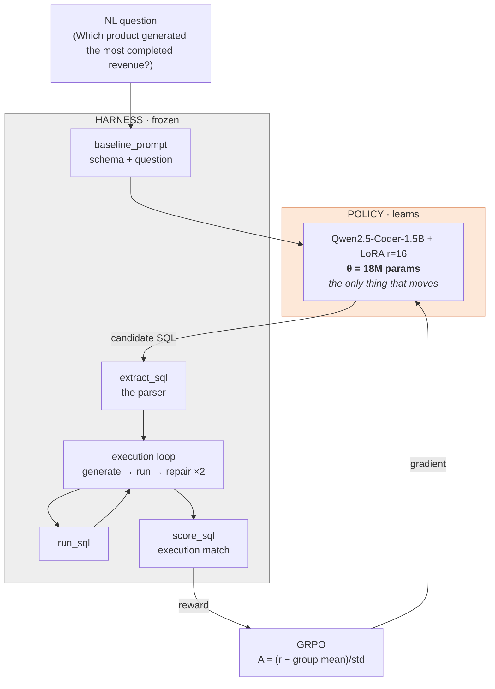
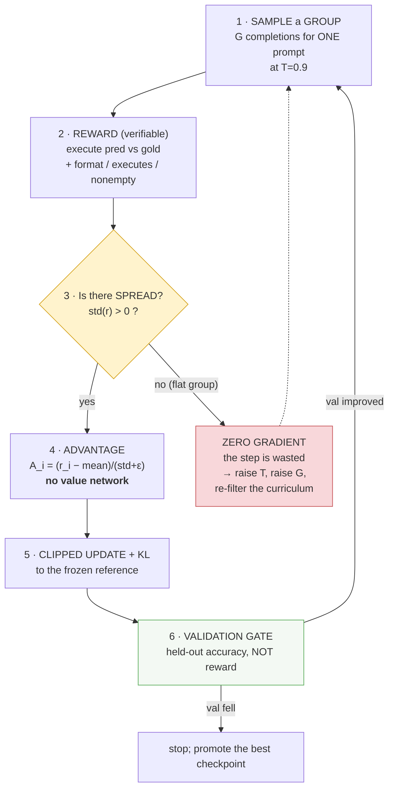
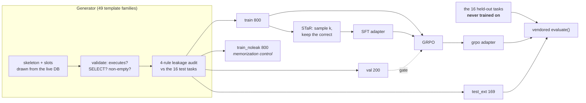
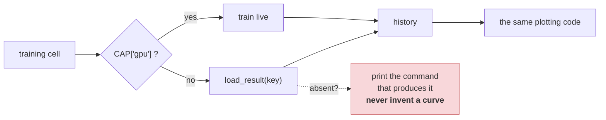

# Architecture: Self-Improving Agents by Optimizing the Weights

> **The one thesis:** an agent = a **harness** + a **policy**. Repo 1 froze the
> policy and evolved the harness. This repo freezes the harness and evolves the
> policy.
>
> **The reward is the loss · the LoRA adapter is the parameter vector · the
> trajectory group is the gradient.**

This document is the map. It connects the nine notebooks into one picture and
shows what each one moves.

> 🖼️ **Slide-ready exports** (SVG + PNG, 3x) of every diagram below live in
> [`docs/diagrams/`](docs/diagrams/). Re-export after editing with
> `python scripts/export_diagrams.py`.

---

## 1. The anatomy: what is frozen and what learns



Everything in the grey box is a **vendored copy of repo 1's code**, and
`tests/test_vendored_parity.py` fails the build if a single byte changes. That
is not tidiness — `score_sql` *is* the reward we optimise 18M parameters
against, and if it drifted, every number in both repos would silently stop being
comparable.

The one modification is a single `llm_fn` hook in `make_agent`, which is what
lets a local policy, an ART-served endpoint, and the OpenAI client all drive the
*same* agent.

---

## 2. The notebook journey

```mermaid
flowchart LR
    NB0["NB0 · Two agents<br/>one scoreboard<br/><i>the 35-point gap</i>"]
    NB1["NB1 · The MDP<br/>state/action/reward<br/><i>variance is the signal</i>"]
    NB2["NB2 · Data + STaR<br/>construct the gold<br/><i>the filter is the reward</i>"]
    NB3["NB3 · GRPO<br/>group mean = baseline<br/><i>no value network</i>"]
    NB4["NB4 · Multi-turn<br/>mask the tool output"]
    NB5["NB5 · OpenPipe ART<br/>the production wrapper"]
    NB6["NB6 · Reward hacking<br/><i>the scissors chart</i>"]
    NB7["NB7 · Deployment<br/>merge, serve, $/1k"]
    NB8["NB8 · Capstone<br/>weights vs harness<br/><i>+ the hybrid</i>"]

    NB0 --> NB1 --> NB2 --> NB3 --> NB4 --> NB5 --> NB6 --> NB7 --> NB8
```



| NB | Module | Moves | The new idea |
|---|---|---|---|
| **NB0** | M1 | nothing | the policy is differentiable now — and it starts 35 points behind |
| **NB1** | M1 | nothing | **reward variance within a sampled group** is the learning signal |
| **NB2** | M2, M4 | the data | construct the gold; then bootstrap from the model's own successes |
| **NB3** | M2 | **θ** | the group mean is the baseline — that is why it fits on a T4 |
| **NB4** | M4 | **θ** | credit assignment across turns; mask the environment's text |
| **NB5** | M3 | **θ** | ART owns the infrastructure you should not be writing |
| **NB6** | M5 | — | the reward is an attack surface and your optimizer is the attacker |
| **NB7** | M5 | — | accuracy is one axis; latency and $/1k are the other two |
| **NB8** | — | — | harness and weights are orthogonal; ship both |

---

## 3. The training loop



**Step 3 is the one people skip.** GRPO's baseline is the group mean, so a group
whose members all score the same produces zero advantage for every member and
the entire step does nothing. Instrument `frac_zero_advantage` from step 0.

**Step 6 is inherited from repo 1.** Its validation gate stopped an unvetted
skill pool from degrading accuracy ~25%; here the same gate stops a reward-hacked
checkpoint from being promoted. Same idea, different parameter vector.

### The correspondence with repo 1

| Repo 1 (harness) | This repo (weights) |
|---|---|
| the skill document | the **LoRA adapter** (18M params, 36MB) |
| a reflection proposing an edit | the **advantage** of a sampled completion |
| accept/reject an edit | a **gradient step** |
| error on a held-out split | the **verifiable reward** |
| the validation gate | **early stopping on val accuracy** |
| EvoSkill mutate + select | **GRPO group sampling** |
| the 25%-degrade trap | **reward hacking** (NB6) |
| W&B curves | W&B curves |

Both are reinforcement learning. One does it in text space with no gradients;
the other does it in parameter space with them.

---

## 4. Data flow



**Three eval sets, three jobs.** test-16 is the *comparability* number and the
only one commensurate with repo 1's 0.75 — its interval is ±20pp, so treat it
accordingly. val-200 gates. test_ext-169 is the *generalization* number with real
power (±7pp) and is where claims should be made.

---

## 5. The no-GPU contract

> **Every notebook renders every chart on a machine with no GPU, no API key, and
> no network.**



Replayed charts carry a *pre-baked* watermark. When an artifact has not been
baked yet, the cell prints how to produce it rather than drawing something
fabricated — a chart built from nothing is worse than no chart.

---

## 6. Module map

```
llm_utils/
  db.py tasks.py evaluate.py   VENDORED byte-identical -- the fairness contract
  agents.py                    VENDORED + one llm_fn hook (the hinge)
  llm.py                       VENDORED, Langfuse optional
  sqlio.py       safe_run_sql (closes on the error path) + cached gold scoring
  config.py      capability(), load_result() -- the no-GPU contract
  gen_tasks.py   49 families, slot domains, the 4-rule leakage audit
  rollout.py     SQLEnv, Trajectory, rollout_group, advantages
  rewards.py     the verifiable reward + the deliberately hackable proxy
  local_llm.py   LocalLM.as_llm_fn() -- local policy drives the vendored agent
  datasets.py    STaR sampling, SFT/GRPO dataset builders, curriculum filter
  trainers.py    T4-safe configs, kwarg filtering, merge, push
  art_bridge.py  our Trajectory <-> ART; art_probe() before trusting it
  metrics.py     Wilson CI, paired bootstrap, McNemar -- no bare accuracies
  plotting.py    house style; the 0.75 line on every accuracy chart
```

---

## TL;DR

1. **Agent = harness + policy.** We hold the harness byte-identical and move the
   policy. The comparison with repo 1 is enforced by a hash, not a promise.
2. **The reward must be verifiable**, and it must keep `min_correct >
   max_incorrect`. Ours has a margin of 0.70.
3. **GRPO's baseline is the group mean** — no critic, which is why it fits on a
   free T4. A flat group is a wasted step; measure that.
4. **Gate on validation accuracy, not reward.** When they diverge, the reward is
   lying to you.
5. **At n=16, report intervals and paired tests.** One task is 6.25 points.
6. **Harness and weights are orthogonal.** The hybrid is one line of code —
   which is the dividend of never having touched the harness.
