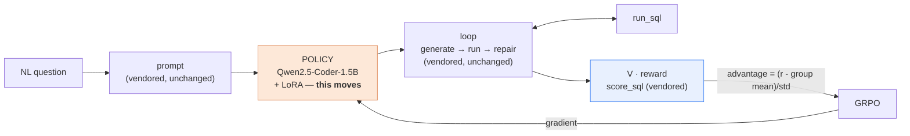

# Self-Improving Agents by Optimizing the Weights (One Free T4)

**Reinforcement Learning for LLM Agents: Training, Fine-Tuning & Deployment**
DataHack Summit 2026 · full day · Bhaskarjit Sarmah

The sibling of
[**RL-Agents-Workshop**](https://github.com/bhaskarjitsarmah/RL-Agents-Workshop).
That repo froze the brain and evolved the harness. **This one freezes the harness
and evolves the brain.**

> *The reward is the loss, the LoRA adapter is the parameter vector, and the
> trajectory group is the gradient.*

Same task. Same agent. Same 16 held-out tests. Same `score_sql`.
**Only the parameter vector moves.**



## The one comparison this repo exists to make

Repo 1's published result, on 16 held-out text-to-SQL tasks:

| agent | accuracy |
|---|---|
| `gpt-4o-mini` + repair loop | **0.750**  [0.505, 0.898]  (12/16) |

Everything here is measured against that number, by the **same `evaluate()`
function running the same `score_sql` over the same 16 tasks**. `db.py`,
`tasks.py`, and `evaluate.py` are byte-identical vendored copies, and
`tests/test_vendored_parity.py` fails the build if a single character changes.
See [VENDORED.md](VENDORED.md).

That is the whole point: if the two repos' numbers are not directly comparable,
neither of them means anything.

## Read the interval, not the accuracy

At n=16, one task is 6.25 percentage points:

```
12/16 = 0.750   [0.505, 0.898]
13/16 = 0.813   [0.570, 0.934]
```

Those intervals almost entirely overlap. **A one-task improvement is not
evidence of anything.** So no accuracy is printed anywhere in this repo —
including in this README — without its interval and its n:

```python
from llm_utils import report_number, evaluate, make_agent
print(report_number(evaluate(make_agent(), split="test"), "gpt-4o-mini"))
# gpt-4o-mini: 0.750  [0.505, 0.898]  (12/16)
```

Comparisons use **paired** tests on per-item correctness (`paired_bootstrap`,
`mcnemar`), because every agent is scored on the identical items.

Three eval sets, three jobs:

| set | n | job |
|---|---|---|
| **test-16** | 16 | *comparability* — the only number commensurate with repo 1's 0.75 |
| **val** | 200 | *gating* — early stopping and checkpoint selection |
| **test_ext** | 169 | *generalization* — the same query patterns, fresh instances, ~±7pp instead of ~±20pp |

## The five modules (AV agenda)

| # | Module | Notebook |
|---|---|---|
| 1 | Foundations: agents as policies, MDPs, environment interaction | NB0, NB1 |
| 2 | RL methodologies: PPO, GRPO, policy optimization, reward design | NB2, NB3 |
| 3 | OpenPipe ART implementation + W&B tracking | NB5 |
| 4 | Practical workflow: task/environment design, tools, hierarchy | NB2, NB4 |
| 5 | Evaluation & safety: metrics, reward hacking, deployment | NB6, NB7, NB8 |

| NB | Title | The one new idea |
|---|---|---|
| **NB0** | Two agents, one scoreboard | the policy is now something we can differentiate through — and it starts far behind |
| **NB1** | The MDP: state, action, reward, trajectory | **reward variance across a sampled group is the learning signal** |
| **NB2** | A verifiable task generator + a STaR warm start | **construct** the gold, don't guess it; then bootstrap from the model's own successes |
| **NB3** | GRPO | no value network — **the group mean is the baseline** |
| **NB4** | Multi-turn RL: training the tool loop | credit assignment across turns; mask tool output out of the loss |
| **NB5** | The same experiment in OpenPipe ART | the production wrapper |
| **NB6** | Reward hacking, robustness, safety gates | the reward function is an attack surface, and the attacker is your own optimizer |
| **NB7** | Deployment: merge, serve, measure | accuracy is one axis; latency and $/1k queries are the other two |
| **NB8** | Capstone: weights vs harness, head to head | they're orthogonal — and the hybrid is what you ship |

## Setup

**Training is Colab-only.** `bitsandbytes` on Windows is unreliable, and a
half-working local install is worse than a clearly absent one. Locally you can
run evaluation, data generation, the reward and MDP experiments, the analysis,
and every chart.

```bash
git clone https://github.com/bhaskarjitsarmah/RL-Agents-Workshop-LLM.git
cd RL-Agents-Workshop-LLM
python -m venv .venv && source .venv/bin/activate    # Windows: .venv\Scripts\activate
pip install -r requirements.txt                       # local / CPU
cp .env.example .env                                  # only WANDB_API_KEY is required
pytest tests/ -q                                      # 84 tests, ~80s
```

On Colab each notebook's first cell clones and installs
`requirements-colab.txt` (pinned — unpinned installs are the #1 cause of a dead
workshop) and prints the GPU report. See [SETUP.md](SETUP.md) and
[COLAB.md](COLAB.md).

**Before authoring or editing training code, run:**

```bash
python scripts/check_api_surface.py
```

It prints the *actual* dataclass fields of `SFTConfig` / `GRPOConfig` and ART's
namespace for the versions you resolved. TRL's field names churn between minor
versions; correct `llm_utils/trainers.py` against that output rather than
against documentation or memory.

## Every notebook runs without a GPU

A hard rule, enforced by `config.capability()`:

> Every notebook renders **every chart** on a machine with no GPU, no OpenAI
> key, and no network.

Training cells branch:

```python
history = train(...) if CAP["gpu"] else load_result("nb3_grpo_history")
```

Replayed charts carry a *pre-baked* watermark, so nobody mistakes someone
else's run for their own. Pre-baked adapters live on the public HF Hub; W&B
histories are exported to `data/results/*.json` and checked in.

## The task data

40 original tasks (24 train / 16 test) are not a training set for GRPO — they
are a rounding error. A template generator produces:

| file | n | role |
|---|---|---|
| `tasks_train_gen.jsonl` | 800 | training |
| `tasks_val_gen.jsonl` | 200 | gating |
| `tasks_test_ext_gen.jsonl` | 169 | generalization |
| `tasks_train_noleak_gen.jsonl` | 800 | memorization control (test patterns excluded) |

**Gold SQL is constructed, never generated.** One namespace formats both the
question paraphrase and a hand-verified SQL skeleton, so a value in the question
*is* the value in the query. Slot values are drawn from the live database, so a
price threshold is a real quantile and every task is answerable.

Leakage is audited against the 16 test tasks under four rules and reported in
`data/leakage_audit.json` — a chart in NB2, not a claim in a README. Empty-result
golds are rejected outright: `score_sql` compares result sets, so a gold
returning nothing is matched by *every* unrelated query that also returns
nothing, which is a reward-hacking surface rather than a weak signal.

Regenerate (deterministic) with `python scripts/generate_tasks.py`, and review
the skeletons by hand — the one check a machine cannot do — with
`python scripts/review_sample.py --skeletons`.

## Repo layout

```
llm_utils/
  db.py tasks.py evaluate.py    VENDORED byte-identical (hash-asserted)
  agents.py                     VENDORED + one `llm_fn` hook
  llm.py                        VENDORED, Langfuse made optional
  sqlio.py        safe/fast SQL: closes on the error path, caches gold
  config.py       capability(), load_result() -- the no-GPU contract
  gen_tasks.py    49 template families + the 4-rule leakage audit
  rollout.py      SQLEnv, Trajectory, rollout_group, advantages
  rewards.py      the verifiable reward + the deliberately hackable proxy
  local_llm.py    LocalLM.as_llm_fn() -- the hinge
  evaluate_batch.py, datasets.py, trainers.py, metrics.py, plotting.py
data/       generated tasks, leakage audit, pre-baked results
nbsrc/      notebook cell definitions      notebooks/  generated .ipynb
scripts/    generate_tasks, review_sample, check_api_surface, run_*
tests/      84 tests: parity, generator, rewards, MDP, statistics
```

## Cost

The training loop makes **no API calls at all** — the policy is local and the
reward is a local SQLite query. A full day costs a free Colab runtime plus a few
cents of OpenAI if you want to reproduce the `gpt-4o-mini` comparison rows
(otherwise they are read from repo 1's published `baseline_test.json`).

## Which repo should you use?

| Situation | Optimize the harness (repo 1) | Optimize the weights (here) |
|---|---|---|
| < 50 labelled examples | ✅ | ❌ |
| No verifiable reward | ✅ | ❌ (needs RULER / a judge) |
| Need a change today | ✅ | ❌ |
| Latency / $ per call is the constraint | ❌ | ✅ |
| Stable, high-volume task | partly | ✅ |
| Offline / on-prem / data residency | ❌ | ✅ |
| Behaviour must be auditable | ✅ (text diffs) | harder (weight diffs) |

*Harness optimization buys the most accuracy per hour of engineering. Weight
optimization buys the smallest model that can hold that accuracy. The hybrid is
what you actually ship — and in NB8 it is one line of code, because we never
changed the harness.*
