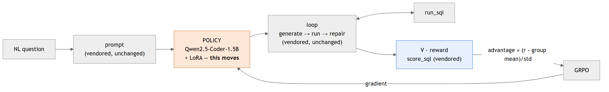
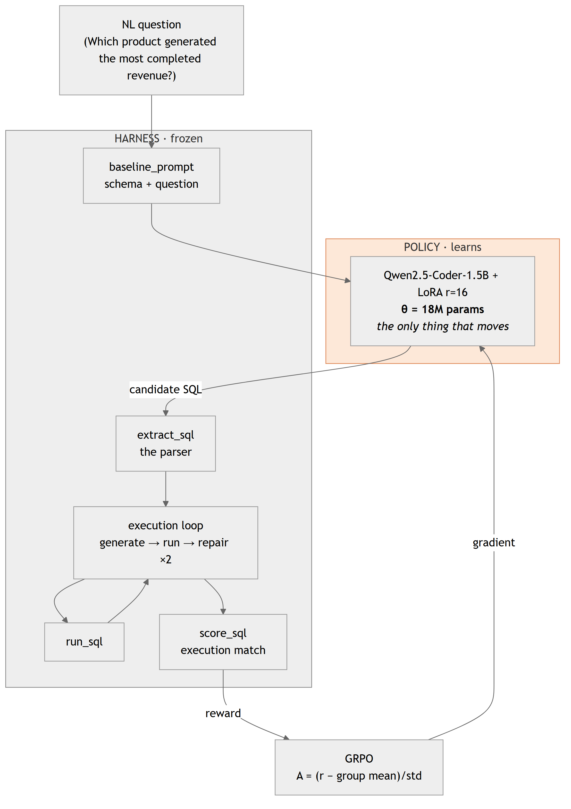
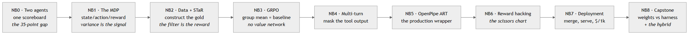
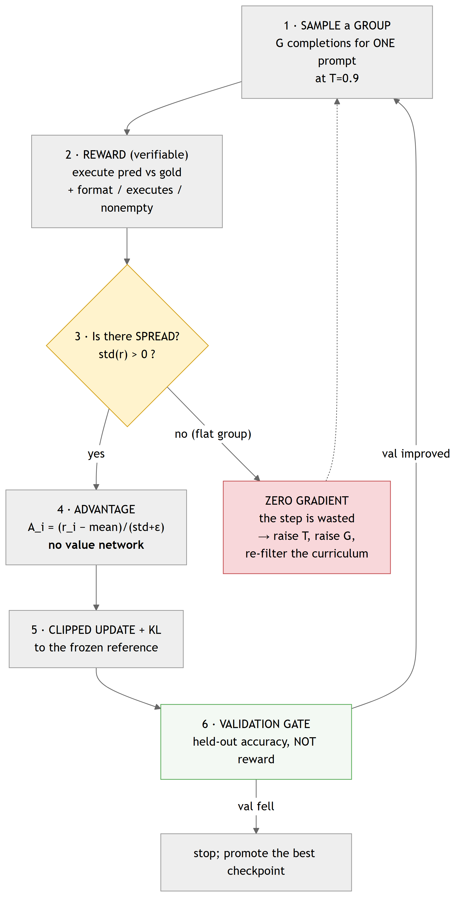
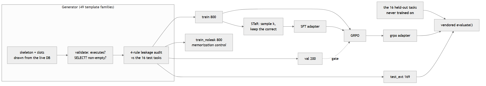
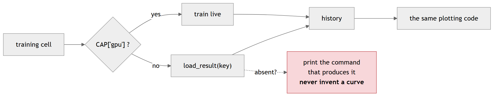

# Slide-ready diagrams

Exported from the Mermaid sources in [`../../ARCHITECTURE.md`](../../ARCHITECTURE.md) and [`../../README.md`](../../README.md) — never maintained separately, because a diagram kept in two places diverges and the slide always ends up with the stale copy.

**SVG** is vector (crisp at any size, best for slides); **PNG** is 3x scale for pasting anywhere.

```bash
python scripts/export_diagrams.py          # re-export after editing a doc
python scripts/export_diagrams.py --check  # verify they are current
```

| # | Diagram | Files |
|---|---|---|
| 00 | Big-picture overview (frozen harness + learning policy) | `00-overview.svg` / `.png` |
| 01 | What is frozen and what learns | `01-frozen-vs-learning.svg` / `.png` |
| 02 | The NB0 -> NB8 journey | `02-notebook-journey.svg` / `.png` |
| 03 | The GRPO training loop (with the zero-advantage branch) | `03-training-loop.svg` / `.png` |
| 04 | Data flow: generator -> four splits -> one scorer | `04-data-flow.svg` / `.png` |
| 05 | The no-GPU replay contract | `05-no-gpu-contract.svg` / `.png` |

---

### 00 · Big-picture overview (frozen harness + learning policy)



### 01 · What is frozen and what learns



### 02 · The NB0 -> NB8 journey



### 03 · The GRPO training loop (with the zero-advantage branch)



### 04 · Data flow: generator -> four splits -> one scorer



### 05 · The no-GPU replay contract


